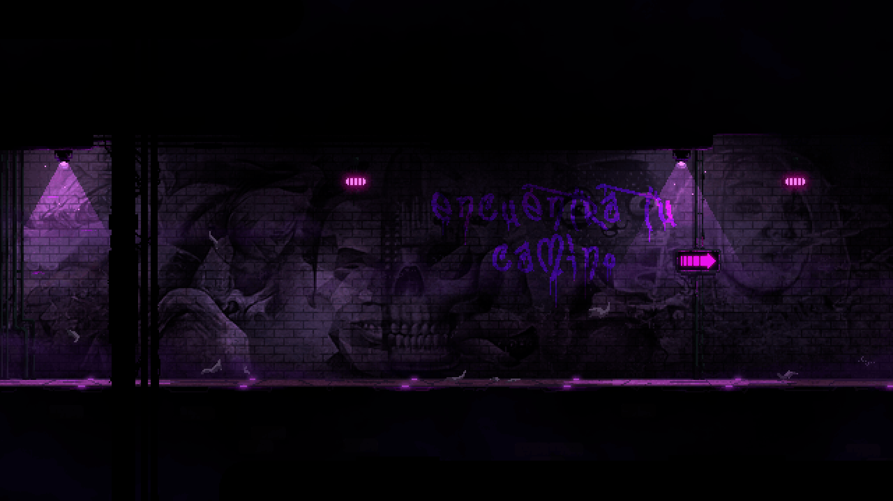
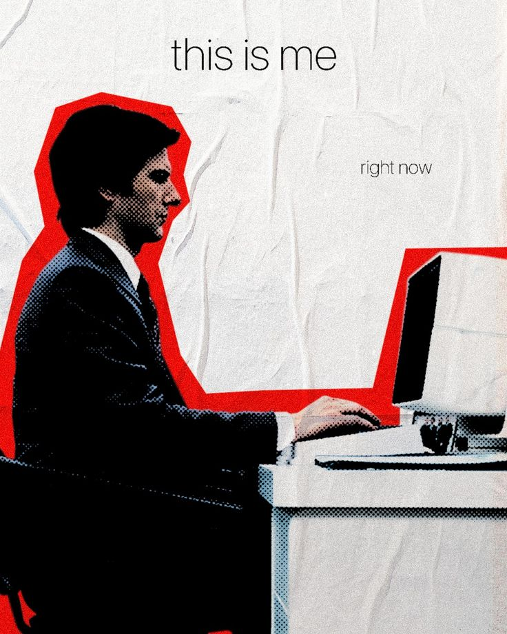

<!-- Banner -->
<div align="center">
  
</div>

<!-- Typing animation -->
<p align="center">
  <a href="https://git.io/typing-svg">
    
  </a>
</p>

  
<!-- Social Buttons -->
  <div align="center">
    <a href="mailto:wf0403trabalho@gmail.com" target="_blank">
      
    </a>
    <a href="https://www.linkedin.com/in/wesley-flores-a86177261/" target="_blank">
      
    </a>
    <a href="https://x.com/West372213" target="_blank">
      
    </a>
  </div>

###
---

<br clear="both">



###
<h3 align="left">❄️ About Me &lt; W &gt;</h3>

<p align="left">
🧑‍💻 My name is..., but you can call me <strong>West</strong><br>
💻 My main focus is <strong>Back-End Development</strong> with <strong>Java</strong>, and I plan to study <strong>Go</strong> soon<br>
🔐 Passionate about <strong>Cybersecurity</strong> and <strong>Pentesting</strong> as complementary skills<br>
🎯 Always learning, building, and breaking (ethically) 🔧
</p>

###

<br>


---
### 🛠️ Tech Stack 

<div align="center">
  
</div>

<br>

<div align="center">
  <a href="https://wakatime.com/@2ba737bd-b93b-4ab0-88f4-1f35557d71c4" target="_blank">
    
  </a>
</div>

<br>

```yaml
Languages:     Java, JavaScript, TypeScript, Go (learning)
Back-End:      Node.js, Fastify
Mobile:        React Native (TypeScript + Realm), Kotlin (Android Studio)
Database:      PostgreSQL, SQLite, MongoDB (learning)
Tools:         Git, Postman, IntelliJ, OWASP ZAP, ffuf, hydra
Pentest:       Burp Suite, Nmap, SQLMap, Nikto, dirsearch
```

---

### 🔥 My GitHub Stats

<table align="center">
  <tr>
    <td align="center">
      
    </td>
    <td align="center">
      
    </td>
  </tr>
</table>

<br>

<!-- Visitors counter -->
<div align="center">
  
</div>


<!-- Footer Banner -->
<div align="center">
  
</div>
